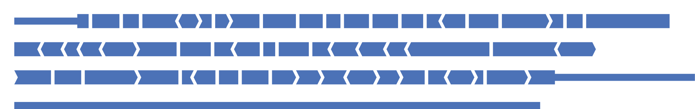
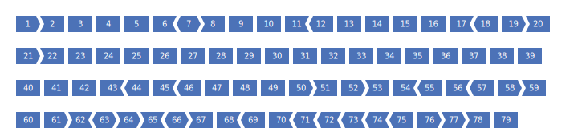

Examples
========

Below are some examples of the kinds of transcript that ExonViz can create.

SDHD
----
Visualise two variants in the SDHD gene

.. code-block:: console

   exonviz --transcript "NM_003002.4:r.[274G>T;300del]" --exonnumber > SDHD.svg

NF1
---
Visualise NF1, setting the width of the figure to the size of the largest exon

.. code-block:: console

   exonviz --transcript "ENST00000358273.9" --noncoding --width 3600 --height 75 > NF1-202.svg

Schematic representation of DMD
-------------------------------
Create a schematic visualisation of the DMD gene. Since this gene is very large, we will first export the exons to TSV format, and then modify each exon to have the same size.

.. code-block:: bash

    # Write the exons in TSV format to dmd.tsv
    exonviz --transcript DMD --exonnumber --dump-exons dmd.tsv
    
    # Next, modify each exon to be 30 bp in your favorite text editor
    # Don't forget to also update the size of the coding region for each exon
    # (see the table below)

    # Finally, draw the exons from the TSV file
    exonviz --exon-tsv dmd.tsv --width 750 --gap 0 > DMD-schematic.svg

.. csv-table:: TSV file for schematic representation of DMD
   :delim: tab
   :file: ../figures/DMD-schematic.tsv

DM20 and PLP1
--------------
The PLP1 gene has two main isoforms, namely `PLP1 (ENST00000621218.5)` and `DM20 (ENST00000619236.1)`. `DM20` is the shorter form of the protein, missing the last 35 amino acids from the third exon. Either isoform can be drawn by ExonViz directly. In the literature, the third exon is often divided in two parts. The first part, termed `3A` is present in each isoform, while the second part, termed `3B`, is missing from `DM20` (for example, `Shy et al., 2016 <https://www.ncbi.nlm.nih.gov/pmc/articles/PMC4744322/>`_).
The figure and associated TSV file are shown below, note that exon 3 has been split into two parts, `3A` and `3B`.

.. code-block:: bash

   exonviz --exon-tsv PLP1-DM20.csv --scale 1.3 --gap 0 > PLP1-DM20.svg

.. csv-table:: TSV file for PLP1 and DM20
   :delim: tab
   :file: ../figures/PLP1-DM20.csv
