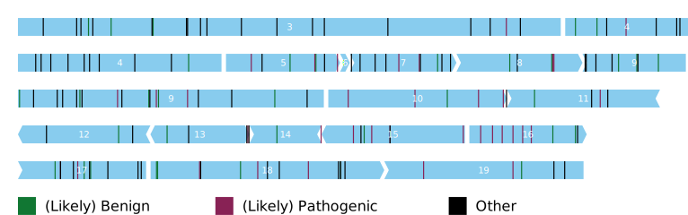

Examples
========

Below are some examples of the kinds of transcript that ExonViz can create.

SDHD
----
Visualise two variants in the SDHD gene

.. code-block:: console

   exonviz --transcript "NM_003002.4:r.[274G>T;300del]" --exonnumber > SDHD.svg

NF1
---
Visualise NF1, setting the width of the figure to the size of the largest exon

.. code-block:: console

   exonviz --transcript "ENST00000358273.9" --noncoding --width 3600 --height 75 > NF1-202.svg

.. image:: ../figures/NF1-202.svg

Schematic representation of DMD
-------------------------------
Create a schematic visualisation of the DMD gene. Since this gene is very large, we will first export the exons to TSV format, and then modify each exon to have the same size.

.. code-block:: bash

    # Write the exons in TSV format to dmd.tsv
    exonviz --transcript DMD --exonnumber --dump-exons DMD-schematic.tsv

    # Next, modify each exon to be 30 bp in your favorite text editor
    # Don't forget to also update the size of the coding region for each exon
    # (see the table below)

    # Finally, draw the exons from the TSV file
    exonviz --exon-tsv DMD-schematic.tsv --width 750 --gap 0 > DMD-schematic.svg

.. csv-table:: TSV file for schematic representation of DMD
   :delim: tab
   :file: ../figures/DMD-schematic.tsv

DM20 and PLP1
--------------
The PLP1 gene has two main isoforms, namely `PLP1 (ENST00000621218.5)` and `DM20 (ENST00000619236.1)`. `DM20` is the shorter form of the protein, missing the last 35 amino acids from the third exon. Either isoform can be drawn by ExonViz directly. In the literature, the third exon is often divided in two parts. The first part, termed `3A` is present in each isoform, while the second part, termed `3B`, is missing from `DM20` (for example, `Shy et al., 2016 <https://www.ncbi.nlm.nih.gov/pmc/articles/PMC4744322/>`_).
The figure and associated TSV file are shown below, note that exon 3 has been split into two parts, `3A` and `3B`.

.. code-block:: bash

   exonviz --exon-tsv PLP1-DM20.tsv --scale 1.3 --gap 0 > PLP1-DM20.svg

.. image:: ../figures/PLP1-DM20.svg

.. csv-table:: TSV file for PLP1 and DM20
   :delim: tab
   :file: ../figures/PLP1-DM20.tsv

NDUFAF6 cryptic exon
--------------------
`Catania et al., 2018 <https://www.nature.com/articles/s10038-018-0423-1>`_ describe a deep intronic variant in `NDUFAF6` which leads to the inclusion of a 124nt cryptic exon.

.. code-block:: bash

   exonviz --exon-tsv NDUFAF6.tsv  > NDUFAF6.svg

.. csv-table:: TSV file for NDUFAF6 cryptic exon
  :delim: tab
  :file: ../figures/NDUFAF6.tsv

CYLD
----
`CYLD` is a tumor supressore gene, which has a clear mutational hotspot in exon
16. In the figure below, all `ClinVar <https://www.ncbi.nlm.nih.gov/clinvar/?term=NM_001378743.1>`_
variants for CYLD transcript `NM_001378743.1` have been visualized using ExonViz.

How to create the figure
^^^^^^^^^^^^^^^^^^^^^^^^
Generating a figure such as this is fairly involved, since it requires
gathering all variants for a given transcript, and then modifying them so they
are displayed per category.

Gather the variants
^^^^^^^^^^^^^^^^^^^
The following should be repeated for every variant category of interest, we will use the category `Likely Pathogenic` as an example. At the time of writing, this gives the following HGVS description:

`NM_001378743.1(CYLD):c.[454_455del;1111del;2040dup;2282_2283del;2616del;2723dup]`.

Note that intronic variants such as `1684+2T>C` should not be included, since they are outside of the exons.

#. Visit `ClinVar <https://www.ncbi.nlm.nih.gov/clinvar/?term=NM_001378743.1>`_ and Download all variants in Tabular (text) format.
#. Open the file in a spreadsheet program, and order all variants using the `Germline consequence` option.
#. Create a compound HGVS description for all variants in a category, for example `Likely Pathogenic`.

Export the variants
^^^^^^^^^^^^^^^^^^^
Use ExonViz to export the exons and variants to TSV files to maninpulate

.. code-block:: bash

   exonviz --dump-variants likely-pathogenic.tsv --transcript "NM_001378743.1:c.[454_455del;1111del;2040dup;2282_2283del;2616del;2723dup]" --scale 1.2 > /dev/null

.. csv-table:: Raw likely pathogenic variants for CYLD
  :delim: tab
  :file: ../figures/CYLD-example.tsv

Update the variants
^^^^^^^^^^^^^^^^^^^
Open the `likely-pathogenic.tsv` file in a spreadsheet program, and update the **name** column to contain `(Likely) Pathognic`, and the **color** option to `red` for each variant.

.. csv-table:: Updated likely pathogenic variants for CYLD
  :delim: tab
  :file: ../figures/CYLD-example-update.tsv

Draw the figure with ExonViz
^^^^^^^^^^^^^^^^^^^^^^^^^^^^
Repeat the above steps for each category from ClinVar you are interested in. When you are satisfied with the variants, you can merge all categories into a single file. You can then draw CYLD from the tsv files you have created. ExonViz will recognise that there are multiple variants with the same `name` and `color`, and will only include each combination in the legend only once.

.. code-block:: bash

   exonviz --width 747 --exon-tsv CYLD-exons.tsv --variant-tsv CYLD-variants.tsv --scale 1.2 --variantshape bar > CYLD.svg

.. csv-table:: Exons for CYLD
  :delim: tab
  :file: ../figures/CYLD-exons.tsv

.. csv-table:: Variants for CYLD
  :delim: tab
  :file: ../figures/CYLD-variants.tsv
