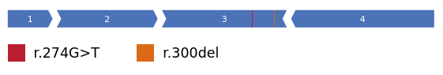

Welcome to the documentation for ExonViz
================================================

ExonViz is a tool to draw transcripts, to scale. You can try the online version on
`exonviz.rnatherapy.nl <https://exonviz.rnatherapy.nl>`_

Check out the :doc:`introduction` section for further information, including
how to :ref:`install<installation>` the project.

.. note::

   This project is under active development. The ExonViz documentation is hosted on Read the Docs.

Contents
--------

.. toctree::

   introduction
   usage
   api
   changelog
