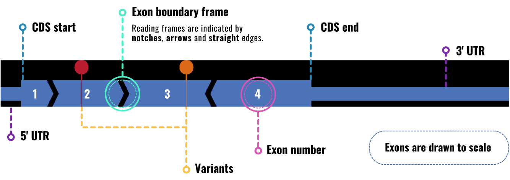
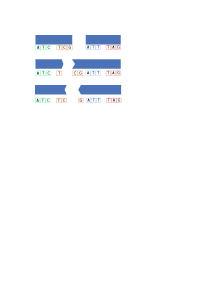

# Summary

`ExonViz` is a Python package and online application that creates biologically
accurate transcript figures, including features such as coding regions, genetic
variants and exon reading frames. ExonViz is written in Python 3, its web
interface is built using Flask. It uses the public Mutalyzer API [@Lefter2021]
to fetch transcript information. This gives ExonViz access to all transcripts
defined in the RefSeq [@OLeary2016] and Ensembl [@Harrison2024] databases
across many species, ranging from human and mouse to fruit fly and coelacanth.
Transcripts and annotations defined on the reverse strand are reversed on the
fly, so ExonViz always visualizes transcripts in their forward orientation.

# Statement of need
Visualization of genes and genetic variants as well as transcript structure is
essential within the human genetics community. Such illustrations represent a
key tool in communicating genetic concepts and facilitating discussions on
therapeutic interventions.

There currently are no easily usable tools which allows the users to draw all
features required for a comprehensive overview of a transcript’s structure and
the localisation of variants of interest.

# Method

The start and end frames, which refers to the alignment between the exon
boundary and the codon boundaries, are indicated by the shape of the exon, as
can be seen in Figure \ref{abstract}. If the first base of an exon is also the
first base of a codon, the start frame of the exon is 0. If an exon starts at
the second base of a codon, the start frame is 1, etc. The same holds for the
end frames. This is illustrated in Figure \ref{explainer}.

The output of ExonViz is an SVG figure generated using the svg-py library,
which can be used directly or modified using modern graphical editing programs.
It is also possible to output the transcript and variants in TSV format, edit
the transcript using any text editor or spreadsheet program, and draw the
modified transcript using ExonViz. The [online
documentation](https://exonviz.readthedocs.io/en/latest/examples.html) has a
number of examples of custom transcripts that can be visualized this way.

# Conclusion
To our knowledge, ExonViz is the first publicly accessible application that
allows for automatic visualization of transcripts with additional features such
as reading frames and variants along the transcript. ExonViz can be used for
illustrations within publications, assessment of treatment options, for
teaching purposes and genetic counseling. Figures generated by ExonViz are free
to use under the Creative Commons BY license . Furthermore, we allow the user
to construct their own transcripts to incorporate features like poison or
cryptic exons and alternative isoforms. ExonViz can be accessed as a web
application via [exonviz.rnatherapy.nl](https://exonviz.rnatherapy.nl) or
installed via [PyPI](https://pypi.org/project/exonviz/). The source code is
available on [Github](https://github.com/DCRT-LUMC/exonviz).

# Acknowledgments
We would like to thank the members of the Dutch Center for RNA Therapeutics for
their ideas, suggestions and their feedback on earlier versions of ExonViz. We
also thank Maximilian Haeussler and his colleagues at the UCSC for their
efforts implementing exon frame information into the UCSC Genome Browser. We
also thank Nanieke van den Berg for creating the figure for this manuscript.

# References
